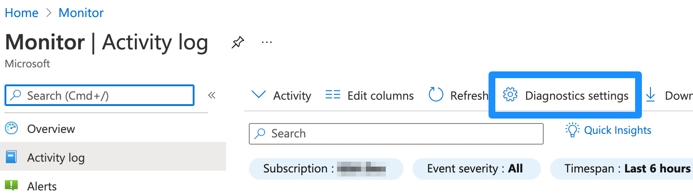
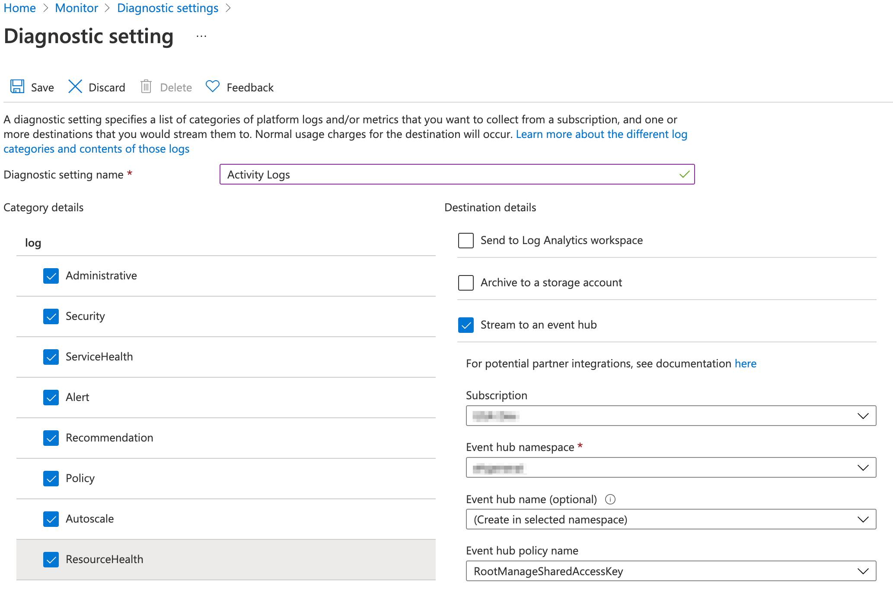

# Sending Azure Activity log data to an Event Hub

## Create a Event Hub for Activity Logs
* From the Azure Portal, select Event Hubs
* Select your Event Hub Namespace
* Select Event Hubs
* Click the **+ Event Hub** button to create a new Event Hub
* Name the hub `insights-activity-logs`
  * Note: `insights-activity-logs` is the default for the functions, but a different name may be used.  If using a different event hub name, update the function application settings to reflect the correct event hub name.
* Set the number of partitions
  * Note: at least 4 partitions are recommended
* Click the **Create** button

## Use a Diagnostic Setting to Send Logs to the Event Hub
* From the Azure Portal, select the [Activity Log](https://portal.azure.com/#blade/Microsoft_Azure_Monitoring/AzureMonitoringBrowseBlade/activityLog)  
* Select **Diagnostics settings**
* Choose an existing setting or create a new setting
* Give the diagnostic setting a name
* Select the events to log
* Select "Stream to an event hub"
* Select your event hub details
* Click the Save button

