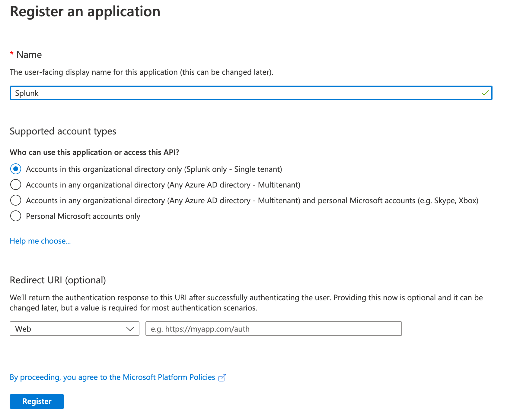
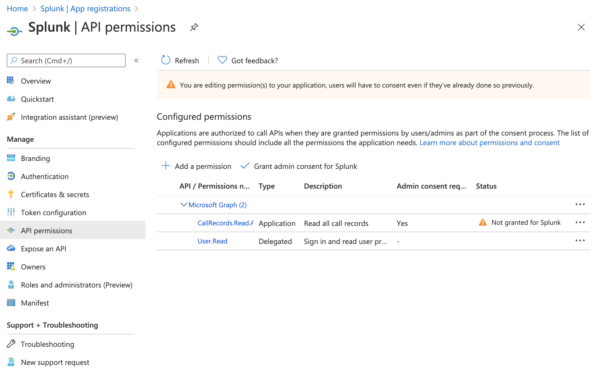

# Registering an Azure AD application

When you register an application with Azure AD, you are creating an identity configuration.  The Azure Functions in this project will use the application for authentication when interacting with the Microsoft Graph API.

## Prerequisites

* An Azure account with an active subscription. [Create an account for free](https://azure.microsoft.com/free/).
* An [Azure AD tenant](https://docs.microsoft.com/en-us/azure/active-directory/develop/quickstart-create-new-tenant).

## Register a new application using the Azure portal

1. Sign in to the [Azure portal](https://portal.azure.com)
1. If your account gives you access to more than one tenant, select your account in the upper right corner. Set your portal session to the Azure AD tenant that you want.
1. Search for and select **Azure Active Directory**. Under **Manage**, select **App registrations**.
1. Select **New registration**.
1. In **Register an application**, enter a meaningful application name.
1. For account type, select **Accounts in this organizational directory only**.
1. **Redirect URI** can be left blank.
1. When finished, select **Register**.

## Add API permissions to the application

1. Select **API permissions**
1. Select **Add a permission**
1. Select **Microsoft Graph**
1. Add appropriate permissions (refer to the section below for required permissions based on resource type).
1. When finished, select **Add permissions**
1. Some permissions require admin consent. For example, in the screenshot below, `CallRecords.Read.All` requires admin consent.
1. If the selected permission requires admin consent, select **Grant admin consent for...**

## Application permissions needed for data collection

| Resource Type | Required Permissions |
| ------------- | -------------------- |
| Call Records  | `CallRecords.Read.All` (Application) |

## Resources

* [Microsoft Graph permissions reference](https://docs.microsoft.com/en-us/graph/permissions-reference)