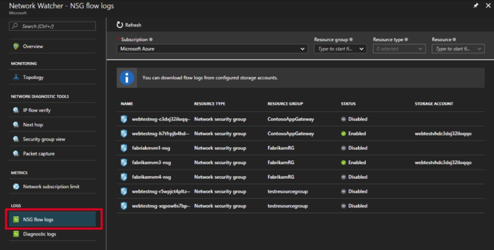
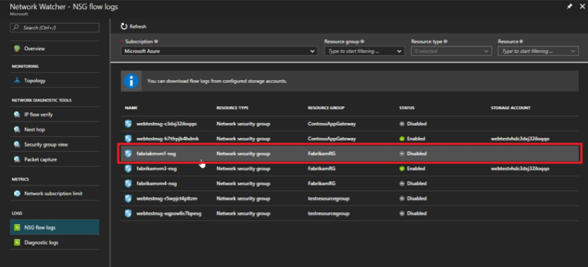
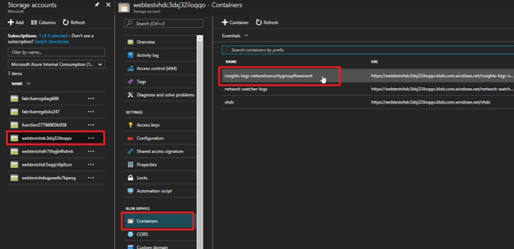

# Azure Functions for Sending Azure Storage data to a Splunk HTTP Event Collector
Azure storage operations can trigger serverless Azure Functions.  Azure Functions can further process the raw events in near real-time.

This repository contains a collection of Azure Functions for:
* Processing [Network Security Group (NSG) Flow Log](https://learn.microsoft.com/azure/network-watcher/network-watcher-nsg-flow-logging-overview) blobs as they are written to an Azure Blob container.
  * This function can separate batched events (events in a `records[]` array) into individual events
  * Optionally, this function can denormalize the events by making each flow tuple a distinct Splunk event
* Formatting events in the `event` format for a Splunk HTTP Event Collector
* Sending event data to Splunk via [HTTP Event Collector](https://docs.splunk.com/Documentation/Splunk/latest/Data/UsetheHTTPEventCollector)
* Writing event data to a separate Storage Blob container if data cannot successfully be sent to Splunk
  * The [Splunk Add-on for Microsoft Cloud Services](https://splunkbase.splunk.com/app/3110/) can be utilized to retrieve Storage Blob data from the separate container

## Getting Started

### 1. Create an HTTP Event Collector token in your Spunk Environment
An HTTP Event Collector receives data pushed from the Azure Functions.  Refer to the Splunk documentation for [setting up an HTTP Event Collector input](https://docs.splunk.com/Documentation/Splunk/latest/Data/UsetheHTTPEventCollector) in your Splunk Enterprise or Splunk Cloud environment.

### 2. Create an Azure Storage Account
Refer to the Microsoft documentation for [Azure Storage Account setup instructions](https://learn.microsoft.com/azure/storage/common/storage-account-create).

### 3. Configuring NSG Flow Logs in the Azure Portal

* From the Azure Portal, navigate to a Network Watcher instance and select Flow Logs

* Select a Network Security Group from the list by clicking it

* Navigate to the correct storage account and then Containers -> insights-logs-networksecuritygroupflowevent

### 4. Deploy the functions to Azure

Use the "Deploy to Azure" button above to deploy the Azure Functions from this repo to your Azure account.  During setup, you will be prompted for the following information:

* Blob Path - this is the blob container containing the NSG Flow logs
* Blob Connection String - this is the connection string for the Azure Storage Account
* NSG Sourcetype
* Splunk [HTTP Event Collector](https://docs.splunk.com/Documentation/Splunk/latest/Data/UsetheHTTPEventCollector) Endpoint
* Splunk [HTTP Event Collector](https://docs.splunk.com/Documentation/Splunk/latest/Data/UsetheHTTPEventCollector) Token
* Denormalize Events
  * If true, each flow tuple will be a separate Splunk event
  * If false, each Splunk event will contain multiple flow tuples
  * Note: see the [NSG log format](https://learn.microsoft.com/azure/network-watcher/network-watcher-nsg-flow-logging-overview#log-format) for more details.

## Securing Azure Function settings
Microsoft stores the above values as [application settings](https://docs.microsoft.com/en-us/azure/azure-functions/functions-how-to-use-azure-function-app-settings#settings). These settings are stored encrypted, but you may opt to transfer one or more of these settings to a Key Vault. Refer to the following documentation for details on this procedure:

* [Use Key Vault references for App Service and Azure Functions](https://docs.microsoft.com/en-us/azure/app-service/app-service-key-vault-references)

## Support
This software is released as-is. Splunk provides no warranty and no support on this software. If you have any issues with the software, please file an issue on the repository.
